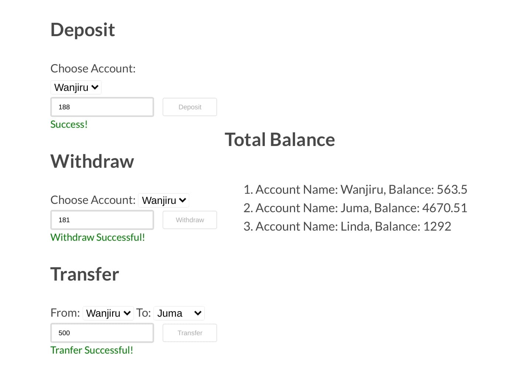

# Js bank

> Banking simulation with js

## Built With

- HTML
- CSS
- Javascript
- Webpack

**This is an documentation of js bank simulation**

## Live Demo(coming soon)

[See live](#)

## Getting Started

To get a local copy up and running follow these simple example steps.

Clone the repo to your local machine.

git clone https://github.com/ksigei/js_bank

cd js_bank
npm install
npm run build
npm start

##Ideas on how you would make the simulation more realistic

1. Create a backend or use an external API to save the data rather than using local storage
2. Use modules instead of just on file, to make code neat
3. Using redux so incase there is huge dataflow, the app will still work fine
4. As it is a banking system, mocking functions using test(eg. using jest) should be done
5. Linting the the code so as to make it clean(checking for errors and removing them, eg using linters)
6. Ensuring best practices, the code should not just work, it should be readable and easy to srcValue
7. Using a front-end library, e.g react or vue to make the program run better
8. Add the currencies so that it can be clears
9. Allow adding of other users through the input form in the UI
10. Use auth(eg sign up with password), to make it safe

balances
Account Name: Wanjiru, Balance: 563.5
Account Name: Juma, Balance: 4670.51
Account Name: Linda, Balance: 1292